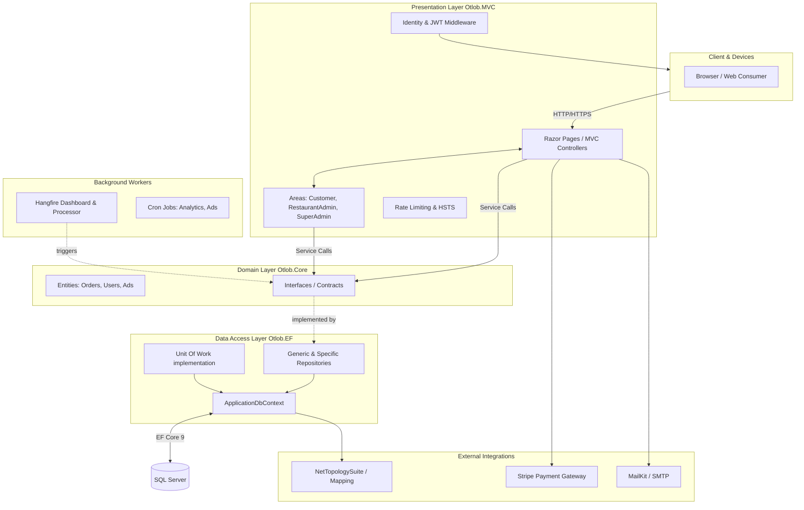

# Otlob - Multi-Tenant Food Delivery & Ordering System

## 1. Project Title & High-Level Overview

**Otlob** (Arabic for "Order") is a comprehensive, multi-tenant digital food delivery and smart ordering platform. Built to scale across hundreds of restaurants and thousands of active users, Otlob addresses the core logistical challenges of food e-commerce by offering robust catalog management, geo-spatial awareness for branches, secure user transactions, granular role-based access, and powerful analytics. Its primary use case revolves around empowering restaurant vendors to effortlessly list products and launch advertisements while bringing a seamless ordering and delivery experience directly to the end consumer.

---

## 2. System Architecture (Visualized)

The solution is architected using an **N-Tier/Clean Architecture-inspired pattern**. The core domain (entities, interfaces) is decoupled from data access and infrastructure layers, ensuring separation of concerns and testability. Dependency Injection is heavily utilized to inject business services, Data Access Contexts, and Unit Of Work operations directly into the presentation layer.



### Architectural Highlights:
- **Presentation (Otlob):** Asp.Net Core MVC & Razor Pages handling routing to Area-based scopes.
- **Domain (Otlob.Core):** Contains the business rules, models (e.g., `Restaurant`, `PromoCode`), and repository interfaces.
- **Infrastructure (Otlob.EF):** Houses the `ApplicationDbContext`, generic `BaseRepository` logic, and the central `UnitOfWork` repository combining context transactions.

---

## 3. Core Modules & Services

| Module / Service | Description |
|------------------|-------------|
| **Identity & Access** | Manages user registration, login flows, Google/Microsoft OAuth integration, and JWT token issuance using ASP.NET Core Identity. |
| **Catalog & Partners** | Orchestrates the `Restaurant`, `RestaurantBranch`, and `TradeMark` entities. Supported by spatial data routing through `NetTopologySuite`. |
| **Ordering Engine** | Manages cart sessions (`TempOrder`), order pipelines, VAT tracking, checkout processing with integrated Stripe payments. |
| **Advertising & Promotions** | Manages dynamic `PromoCode` usage, validation, and platform-wide `Advertisement` lifecycle (hourly activated/expired via backgrounds jobs). |
| **Data Analytics** | Periodically aggregates platform usage, restaurant ratings, and order volumes into daily/monthly historical metrics via automated services. |
| **Notification Engine** | Sends OTP grids, order confirmations, and password resets via reliable email protocols via MailKit/MimeKit. |

---

## 4. User Roles & Authorization

Otlob supports distinct tenant portals using MVC **Areas**:

- **Customer (`/Customer`):** 
  - Standard consumer role. 
  - *Capabilities:* Browse menus, add items to cart, place orders, utilize promo codes, rate restaurants, and save favorite elements.
- **Restaurant Admin (`/RestaurantAdmin`):** 
  - Vendor/Business owner context. 
  - *Capabilities:* Manage their specific products, branches, trademarks, launch promos, and review specific branch insights. Sandboxed to their designated Restaurant Identity.
- **Super Admin (`/SuperAdmin`):** 
  - Full platform management.
  - *Capabilities:* Platform onboarding (approving "Become A Partner" requests), overriding settings, managing users, verifying advertisements, and inspecting application health via the Hangfire Dashboard.

---

## 5. Technology Stack & Tools

* **Backend Framework:** .NET 9.0 SDK, ASP.NET Core (MVC & Razor Pages)
* **Data & ORM:** Entity Framework Core 9, SQL Server, NetTopologySuite (for Geospatial branch mapping)
* **Identity & Security:** ASP.NET Identity, Microsoft/Google OAuth integrations, JWT Bearer tokens
* **Background Jobs:** Hangfire, Hangfire.SqlServer
* **Payment Processing:** Stripe.net
* **Validation & Mapping:** FluentValidation, AutoMapper
* **Logging & Telemetry:** Serilog
* **Utilities:** ClosedXML (Excel exports), MailKit/MimeKit (Decoupled Mailing)

---

## 6. Directory Structure

```text
Otlob/
├── Otlob/                           # Presentation Layer (.NET 9 Web App)
│   ├── Areas/
│   │   ├── Customer/                # Dedicated B2C front-end components
│   │   ├── RestaurantAdmin/         # Restaurant backend control panel
│   │   └── SuperAdmin/              # Core administrative portal
│   ├── Controllers/                 # REST or view-routing controllers
│   ├── wwwroot/                     # Static assets, CSS, JS, uploaded certificates/files
│   ├── Program.cs                   # Pipeline & dependency container configuration
│   └── appsettings.json             # Configuration variables
│
├── RepositoryPatternWithUOW.Core/   # Domain Layer
│   ├── Entities/                    # Database models (Orders, Ads, Users)
│   ├── Interfaces/                  # Abstract service contracts & interfaces
│   └── Otlob.Core.csproj
│
├── RepositoryPatternWithUOW.EF/     # Infrastructure Layer
│   ├── BaseRepository/              # Generic EF Repository implementation
│   ├── UnitOfWorkRepository/        # Unit of Work transaction aggregator
│   ├── Migrations/                  # EF Core database migrations
│   ├── ApplicationDbContext.cs      # Core EF database context
│   └── Otlob.EF.csproj
│
└── Utility/                         # Shared Cross-Cutting Concerns
    └── Utility.csproj               # Helper classes, enums, extensions
```

---

## 7. Local Setup & Getting Started

### Prerequisites
- Install [.NET 9 SDK](https://dotnet.microsoft.com/download/dotnet/9.0)
- Install **SQL Server** (LocalDB or dedicated instance)
- Have IDE of choice (Visual Studio 2022+ recommended or Rider)

### Step-by-Step Instructions

1. **Clone the Repository:**
   ```bash
   git clone https://github.com/AbdelrahmanY25/Otlob.git
   cd Otlob
   ```

2. **Configure AppSettings & User Secrets:**
   - Update `appsettings.json` (or `appsettings.Development.json`) located in the `/Otlob/` directory.
   - Supply valid keys for Stripe, Google/Microsoft Auth, and Mail SMTP.
   - Configure your **Database Connection String**.

3. **Apply Database Migrations:**
   Ensure the EF CLI tools are installed (`dotnet tool install --global dotnet-ef`). 
   Run from the solution root:
   ```bash
   dotnet ef database update --project "RepositoryPatternWithUOW.EF/Otlob.EF.csproj" --startup-project "Otlob/Otlob.csproj"
   ```

4. **Run the Project:**
   Build and start the web server from the main Presentation directory.
   ```bash
   cd Otlob
   dotnet build
   dotnet run
   ```
   
5. **Access the Application:**
   - **Frontend:** Typically located at `https://localhost:5001/Customer/Home`
   - **Hangfire Analytics Pipeline:** `https://localhost:5001/SuperAdmin/Hangfire/Dashboard` *(Requires matching configured Basic Auth credentials).*
